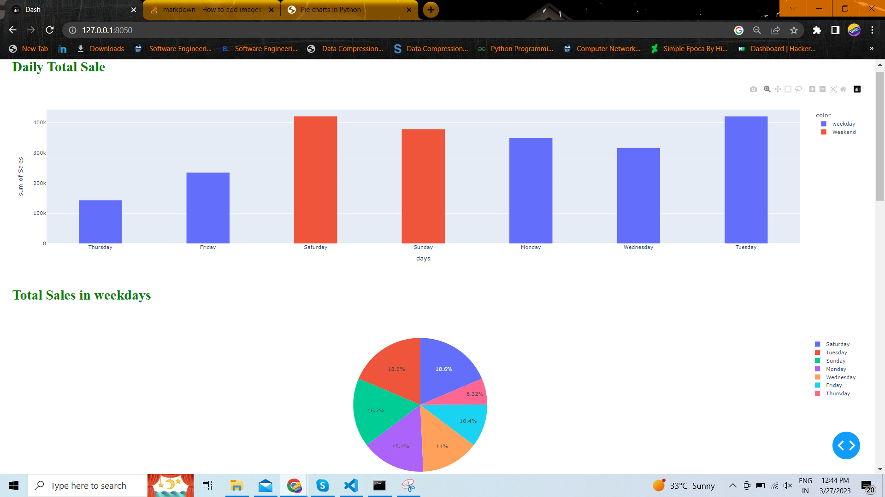

# Sales Data Dashbord 

## creating charts using plotly dash


### Setup environment

```
python -m venv venv 
```
### Activate the environment
```
venv/Scripts/activate
```
### Install requirements
```
pip install -r requirments.txt
```
### Run the main.py file
```
python main.py

```

### Output Image 

